# Does the FrogID data carry usable information about species identity?

**Exploratory data analysis of `data/processed/frog_primary_multiclass.rds`**
STAT5003 group project — FrogID species ranking
Analysis date: 20 September 2026 · Code: [`eda_species_distribution.R`](eda_species_distribution.R)

---

## Verdict

**Yes — and by a wide margin.** Environmental, seasonal and geographic context
reduce 18-class species uncertainty far beyond what class prevalence alone
provides:

| Information available to the model | Top-1 | Top-3 | Macro-F1 | MRR |
|---|---|---|---|---|
| Class prevalence only (baseline) | 35.5% | 60.5% | 0.029 | 0.525 |
| Season only | 40.9% | 64.6% | 0.066 | 0.568 |
| Season + climate | 72.2% | 94.4% | 0.640 | 0.835 |
| Season + climate + elevation + lat/long | **73.4%** | **94.7%** | **0.657** | **0.843** |

Three qualifications matter as much as the headline:

1. **Most of the signal is geographic.** Latitude and longitude *alone* reach
   69.5% Top-1 — within 4 points of the full 30-predictor model. Under a
   spatially blocked split (whole 0.5° grid cells held out), the full model
   falls to **53.1% Top-1 and 0.35 macro-F1**. A random train/test split
   overstates generalisable skill by roughly 20 accuracy points.
2. **The signal is non-linear.** Linear discriminant analysis on the same 30
   predictors reaches only 48.1% Top-1 versus 73.4% for a random forest.
3. **Class imbalance dominates the error structure.** 40.6:1 between the
   largest and smallest class; errors collapse onto the two majority species
   rather than spreading evenly.

The rest of this document supports these conclusions and lists the
preprocessing and validation decisions they imply.

---

## 1. Data and scope

| Property | Value |
|---|---|
| Rows (single-species recording events) | 247,406 |
| Unique `eventID` values | 247,406 (one row per event) |
| Classes (`scientificName`) | 18 |
| Whitelisted predictors | 30 (2 geographic, 6 seasonal, 22 environmental) |
| Date range | 2017-11-10 to 2023-11-09 |
| Rows with missing environmental values | 4,806 (1.94%) |

`epbc_listed` and `epbc_category` are `NA` for every row, and
`epbc_match_status` is `unmatched_to_official_threatened_list` for 245,072
rows and `unresolved_listed_subspecies_only` for 2,334. **No threatened
species is present in this cohort**, so the conservation/geoprivacy part of
the research question cannot be examined here — it needs the multi-species
extension dataset.

### Missingness is a coherent block, but not random

All 22 environmental predictors are missing together on exactly the same 4,806
rows — a WorldClim raster-edge effect, not scattered measurement failure. The
rate is, however, strongly species-dependent (χ² test, p < 0.001), ranging from
0.03% (*Crinia parinsignifera*) to 5.5% (*Litoria quiritatus*) and 3.7%
(*Limnodynastes peronii*).

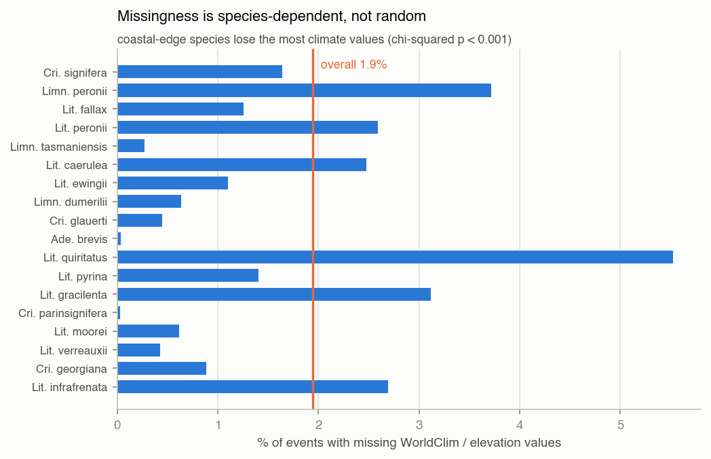

**Implication:** dropping incomplete rows would silently remove coastal-edge
records of specific species. Analyses below use complete cases (242,600 rows)
and say so; the certified dataset is never modified.

---

## 2. Univariate analysis — the response

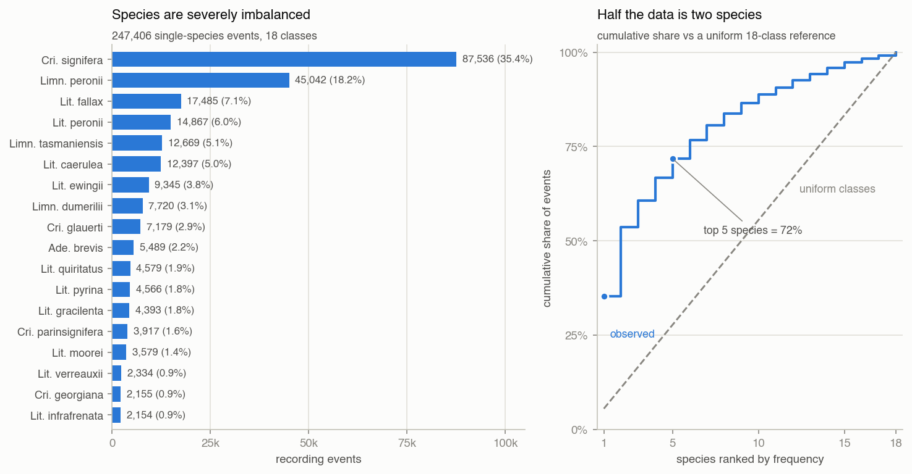

| Species | n | share | cumulative |
|---|---:|---:|---:|
| *Crinia signifera* | 87,536 | 35.4% | 35.4% |
| *Limnodynastes peronii* | 45,042 | 18.2% | 53.6% |
| *Litoria fallax* | 17,485 | 7.1% | 60.7% |
| *Litoria peronii* | 14,867 | 6.0% | 66.7% |
| *Limnodynastes tasmaniensis* | 12,669 | 5.1% | 71.8% |
| *Litoria caerulea* | 12,397 | 5.0% | 76.8% |
| *Litoria ewingii* | 9,345 | 3.8% | 80.6% |
| *Limnodynastes dumerilii* | 7,720 | 3.1% | 83.7% |
| *Crinia glauerti* | 7,179 | 2.9% | 86.6% |
| *Adelotus brevis* | 5,489 | 2.2% | 88.8% |
| *Litoria quiritatus* | 4,579 | 1.9% | 90.7% |
| *Litoria pyrina* | 4,566 | 1.8% | 92.5% |
| *Litoria gracilenta* | 4,393 | 1.8% | 94.3% |
| *Crinia parinsignifera* | 3,917 | 1.6% | 95.9% |
| *Litoria moorei* | 3,579 | 1.4% | 97.3% |
| *Litoria verreauxii* | 2,334 | 0.9% | 98.3% |
| *Crinia georgiana* | 2,155 | 0.9% | 99.1% |
| *Litoria infrafrenata* | 2,154 | 0.9% | 100.0% |

**Imbalance summary**

| Measure | Value | Reading |
|---|---:|---|
| Shannon entropy *H* | 3.214 bits | of a possible log₂18 = 4.170 |
| Normalised entropy | 0.771 | 23% of the label information is already "spent" on imbalance |
| Effective number of classes 2^*H* | 9.28 | the 18 classes behave like ~9 equally common ones |
| Gini impurity | 0.822 | |
| Imbalance ratio (max/min) | 40.6:1 | |
| Majority-class share | 35.4% | the accuracy floor for any model |

*H* = 3.214 bits is the budget every later result is measured against: it is
the amount of class uncertainty the predictors can in principle remove.

**Baselines a model must beat.** A prevalence-only ranker achieves Top-1 35.4%,
Top-3 60.7%, Top-5 71.8%, MRR 0.525 and macro-F1 0.029. Top-5 accuracy is
therefore a weak headline metric here — chance alone gets 72%.

---

## 3. Univariate analysis — the predictors

Selected predictors (full 30-variable table is printed by the script):

| Predictor | mean | sd | min | median | max | missing |
|---|---:|---:|---:|---:|---:|---:|
| decimalLatitude | −32.73 | 5.00 | −43.61 | −33.75 | −9.41 | 0 |
| decimalLongitude | 147.31 | 8.35 | 113.54 | 150.62 | 153.63 | 0 |
| month | 7.58 | 3.51 | 1 | 9 | 12 | 0 |
| BIO1 (mean annual temp, °C) | 16.82 | 3.07 | 3.87 | 17.13 | 28.43 | 4,806 |
| BIO12 (annual precip, mm) | 1045.3 | 370.3 | 162 | 1002 | 5182 | 4,806 |
| BIO15 (precip seasonality) | 36.45 | 20.89 | 8.96 | 29.88 | 143.41 | 4,806 |
| elevation (m) | 187.6 | 255.1 | −3 | 76 | 2130 | 4,806 |

Several environmental variables are strongly right-skewed (BIO13 skew 3.48,
BIO16 3.04, elevation 2.18, monthly precipitation 3.56) — relevant if a
distance- or variance-based method is used later, irrelevant for trees.

### Sampling effort, not ecology

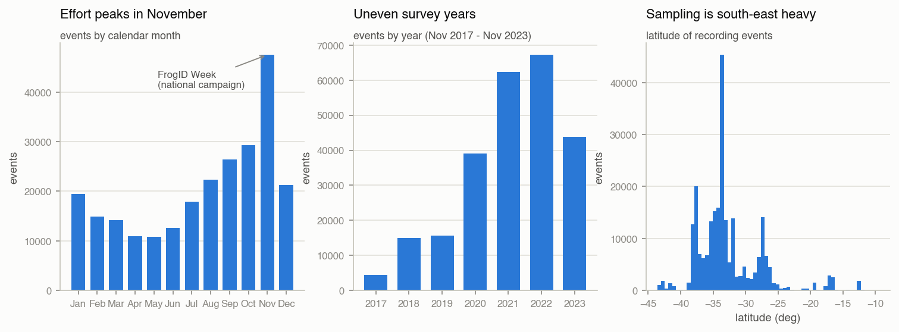

November contributes 19.2% of all records — consistent with the annual FrogID
Week campaign — and 2021–2022 (62,271 and 67,243 events) dwarf 2017–2019
(4,475–15,605).
Latitude is concentrated in the south-east. **Every seasonal, temporal and
spatial pattern below is a pattern in detections, conditional on where and
when people recorded**, not in frog abundance.

---

## 4. Bivariate analysis — each predictor against species

Two complementary measures, both computed on complete cases (n = 242,600):

- **ε² (Kruskal–Wallis)** — the share of rank variation in the predictor
  explained by species;
- **mutual information** — how many of the 3.218 bits of class uncertainty one
  predictor removes on its own (10 quantile bins).

The four cyclic encodings (`month_sin/cos`, `day_of_year_sin/cos`) are omitted
here because they are deterministic transforms of `month` and `day_of_year`;
they re-enter in §7.

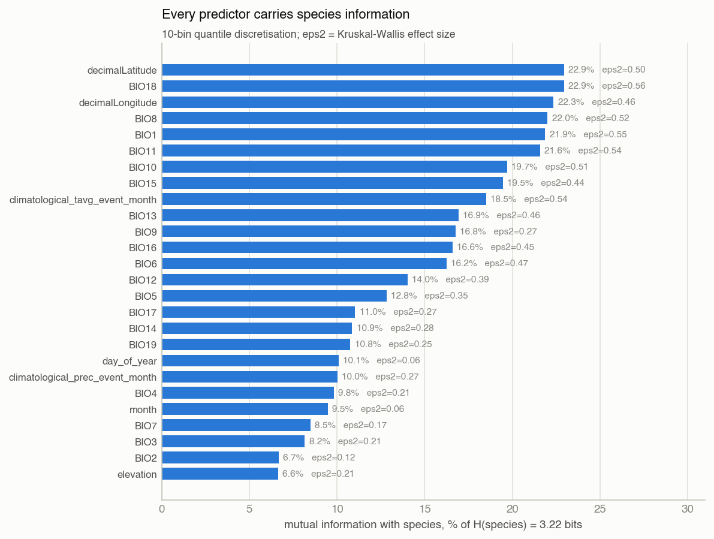

| Predictor | ε² | MI (bits) | MI as % of *H* |
|---|---:|---:|---:|
| decimalLatitude | 0.501 | 0.738 | 22.9% |
| BIO18 (precip of warmest quarter) | 0.563 | 0.738 | 22.9% |
| decimalLongitude | 0.457 | 0.719 | 22.3% |
| BIO8 (mean temp of wettest quarter) | 0.518 | 0.708 | 22.0% |
| BIO1 (mean annual temperature) | 0.548 | 0.704 | 21.9% |
| BIO11 (mean temp of coldest quarter) | 0.545 | 0.695 | 21.6% |
| BIO15 (precipitation seasonality) | 0.440 | 0.627 | 19.5% |
| climatological_tavg_event_month | 0.544 | 0.596 | 18.5% |
| BIO12 (annual precipitation) | 0.386 | 0.451 | 14.0% |
| day_of_year | 0.061 | 0.325 | 10.1% |
| month | 0.061 | 0.305 | 9.5% |
| elevation | 0.211 | 0.214 | 6.6% |

Every predictor is significant at any conventional level (all p < 10⁻¹⁵), but
with n = 242,600 significance is uninformative — the effect sizes are what
matter. The pattern:

- **Climate and location are the strong individual signals** (ε² ≈ 0.44–0.56;
  each alone removes about a fifth of the class uncertainty).
- **Calendar variables are individually weak** (ε² ≈ 0.06, MI ≈ 10%) but, as
  §7 shows, they carry information the climate block does not.
- **Elevation is the weakest** (MI 6.6%), largely because climate already
  encodes it.

### 4.1 Seasonality: species-specific calling windows

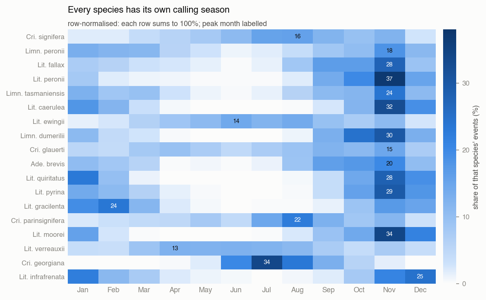

χ²(187) = 106,029, p numerically 0, Cramér's V = 0.197 — a real but moderate
association. The per-species detail is stronger than the aggregate statistic
suggests:

| Species | peak month | peak share | months to cover 80% | circular concentration *R* |
|---|---|---:|---:|---:|
| *Crinia georgiana* | Jul | 33.7% | 4 | 0.81 |
| *Litoria moorei* | Nov | 34.1% | 4 | 0.78 |
| *Litoria peronii* | Nov | 37.1% | 4 | 0.77 |
| *Litoria quiritatus* | Nov | 28.1% | 4 | 0.76 |
| *Litoria caerulea* | Nov | 32.4% | 4 | 0.74 |
| *Crinia signifera* | Aug | 15.6% | 7 | 0.39 |
| *Litoria verreauxii* | Apr | 12.6% | 8 | 0.29 |
| *Crinia glauerti* | Nov | 14.6% | 9 | 0.16 |

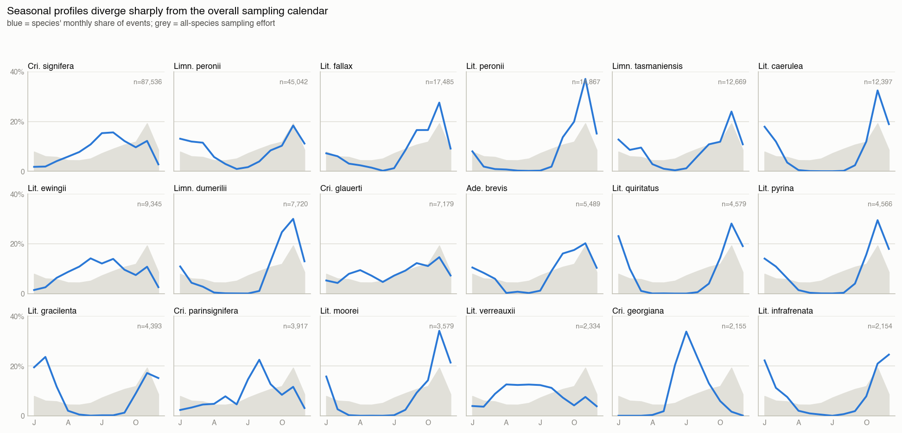

The small multiples separate genuine phenology from campaign effort: *Crinia
georgiana* (winter caller, July peak) and *Litoria gracilenta* (February peak)
peak where overall effort is low, so their timing cannot be an artefact of
FrogID Week. Species whose profile simply tracks the grey effort curve
(*C. glauerti*) contribute little seasonal discrimination.

### 4.2 Geography: near-disjoint ranges

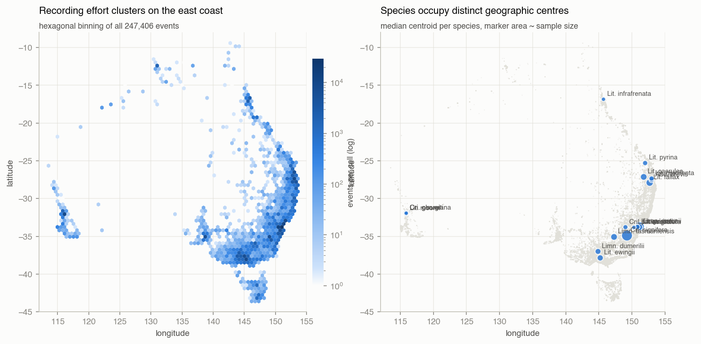
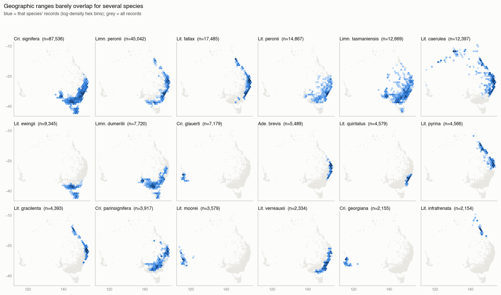

| Species | median km to centroid | 0.5° cells occupied | largest cell's share |
|---|---:|---:|---:|
| *Crinia georgiana* | 1.3 | 33 | 65% |
| *Crinia glauerti* | 3.3 | 27 | 69% |
| *Litoria infrafrenata* | 11.2 | 23 | 63% |
| *Litoria moorei* | 15.0 | 55 | 38% |
| *Litoria peronii* | 34.2 | 278 | 36% |
| *Crinia signifera* | 300.2 | 336 | 9% |
| *Limnodynastes tasmaniensis* | 340.8 | 433 | 12% |
| *Crinia parinsignifera* | 458.5 | 201 | 9% |

Three species (*C. glauerti*, *C. georgiana*, *L. moorei*) are effectively
Perth-only, and *L. infrafrenata* is far-north Queensland only. Knowing the
coordinates of those records nearly determines the label — the reason
latitude/longitude alone reach 69.5% Top-1, and the reason that number should
be treated with suspicion rather than celebrated.

### 4.3 Environment: separable but overlapping envelopes

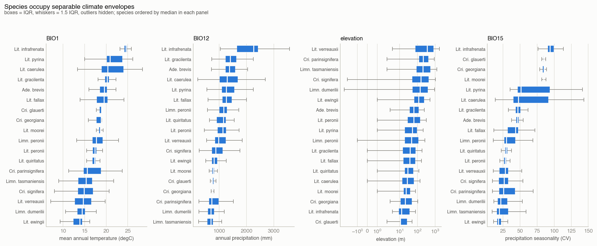

| Species | BIO1 mean (°C) | BIO12 mean (mm) | BIO15 mean | median elevation (m) |
|---|---:|---:|---:|---:|
| *Litoria infrafrenata* | 24.4 | 2161 | 94.2 | 13 |
| *Litoria pyrina* | 21.7 | 1399 | 67.4 | 53 |
| *Litoria caerulea* | 21.4 | 1354 | 61.6 | 27 |
| *Crinia glauerti* | 18.4 | 797 | 83.6 | 11 |
| *Crinia signifera* | 15.0 | 936 | 27.4 | 155 |
| *Limnodynastes dumerilii* | 14.3 | 713 | 25.7 | 140 |
| *Litoria ewingii* | 13.4 | 856 | 20.3 | 118 |

Mean annual temperature spans 11°C across species and annual precipitation
spans a factor of three. Precipitation seasonality (BIO15) cleanly separates
the three Western Australian endemics (81–84, Mediterranean climate) from
south-eastern species (20–30) — a climatic rather than purely spatial
distinction, which is what makes the climate block useful even where
coordinates are withheld.

---

## 5. Bivariate analysis — predictor against predictor

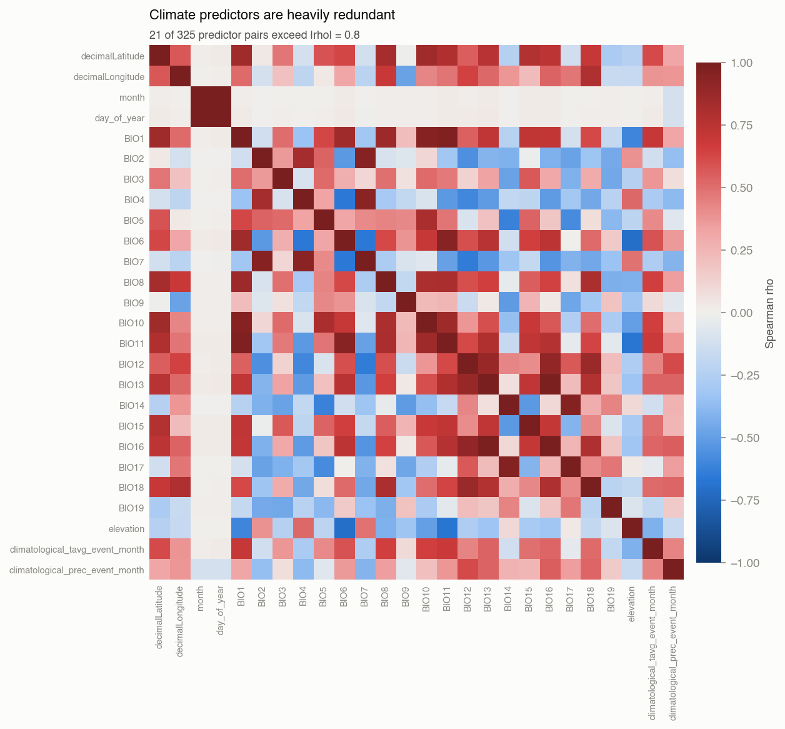

21 of 325 predictor pairs exceed |ρ| = 0.8:

| Pair | Spearman ρ |
|---|---:|
| month ↔ day_of_year | 0.994 |
| BIO13 ↔ BIO16 | 0.990 |
| BIO1 ↔ BIO11 | 0.970 |
| BIO14 ↔ BIO17 | 0.958 |
| BIO1 ↔ BIO10 | 0.950 |
| BIO2 ↔ BIO7 | 0.949 |
| decimalLatitude ↔ BIO10 | 0.850 |

The 22 environmental predictors are close to a 4–6 dimensional system, and the
cyclic encodings (`month_sin/cos`, `day_of_year_sin/cos`) are deterministic
functions of `month` and `day_of_year`. Any method that assumes non-collinear
inputs (multinomial logistic regression, LDA, k-NN on raw scales) needs this
reduced first.

---

## 6. Multivariate structure

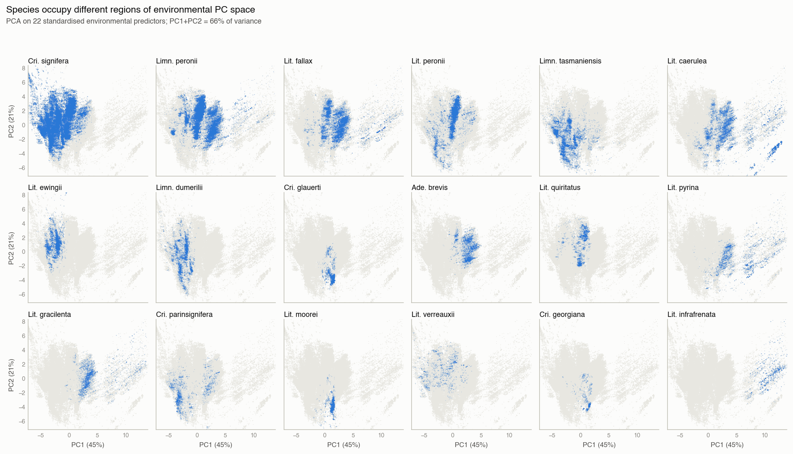

PCA on the 22 standardised environmental predictors:

| Component | variance explained | cumulative |
|---|---:|---:|
| PC1 | 45.4% | 45.4% |
| PC2 | 21.0% | 66.4% |
| PC3 | 11.4% | 77.8% |
| PC4 | 7.2% | 84.9% |
| PC5–PC7 | 9.9% | 94.9% |

PC1 is a warm-and-wet axis (positive loadings on BIO11, BIO6, BIO1, BIO16;
negative on temperature seasonality BIO4/BIO7 and elevation); PC2 separates
high diurnal/annual temperature range (continental) from maritime conditions.
**Seven components retain 95% of the environmental variance** — a 22 → 7
reduction with essentially no information loss.

The small multiples show species occupying distinct, overlapping regions of
this space: complete separation for *L. infrafrenata* and the WA endemics,
heavy overlap among the south-eastern *Litoria*.

---

## 7. How much information do the predictors carry jointly?

Individual MI values understate the case because predictors are complementary.
To quantify the joint content, a random forest (300 trees, `min.node.size = 5`)
was fitted on a 70/30 stratified split of the complete cases, adding one
predictor block at a time — matching the model progression in the project
README. **This is a diagnostic probe, not model selection.**

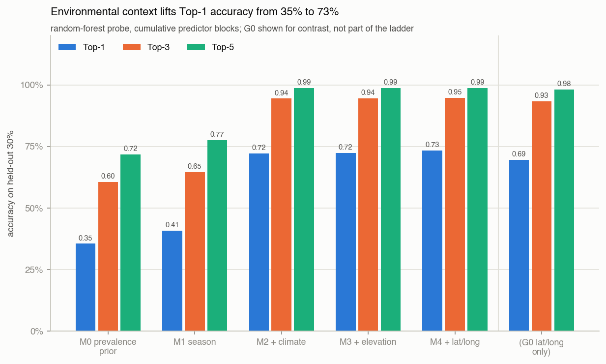

| Model | predictors | Top-1 | Top-3 | Top-5 | Macro-F1 | MRR |
|---|---:|---:|---:|---:|---:|---:|
| M0 prevalence prior | 0 | 0.355 | 0.605 | 0.717 | 0.029 | 0.525 |
| M1 season | 6 | 0.409 | 0.646 | 0.775 | 0.066 | 0.568 |
| M2 + climate | 27 | 0.722 | 0.944 | 0.987 | 0.640 | 0.835 |
| M3 + elevation | 28 | 0.724 | 0.945 | 0.987 | 0.641 | 0.836 |
| M4 + lat/long | 30 | 0.734 | 0.947 | 0.987 | 0.657 | 0.843 |
| *(G0 lat/long only)* | *2* | *0.695* | *0.933* | *0.981* | *0.611* | *0.816* |
| *(LDA, all 30, linear)* | *30* | *0.481* | *0.832* | *0.946* | *0.385* | *0.672* |

Read as marginal value:

- **Season alone: +5.4 points** over prevalence. Real, modest.
- **Climate: +31.4 points** — the decisive block, and it lifts macro-F1 from
  0.07 to 0.64, i.e. it helps the *rare* classes, not just the common ones.
- **Elevation: +0.1 points.** Effectively free-riding on climate; keep only if
  it costs nothing.
- **Coordinates: +1.1 points** on top of climate — but 69.5% on their own.
  Climate and geography are largely substitutes, not complements.
- **Linearity costs 25 points.** LDA reaches 48.1%; the class boundaries in
  this space are not linear.

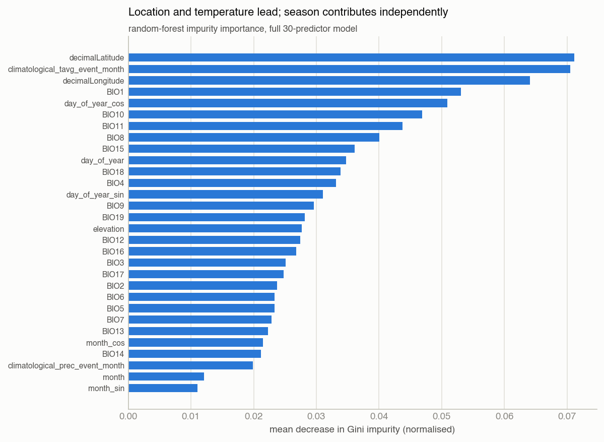

Impurity importance in the full model ranks `decimalLatitude`,
`climatological_tavg_event_month`, `decimalLongitude`, `BIO1` and
`day_of_year_cos` highest. The cyclic date term entering the top five confirms
that season contributes *independently* of climate, even though its standalone
effect size is small.

---

## 8. Robustness: is the model learning ecology or sampling locations?

The concern raised by G0 (coordinates alone ≈ the full model) is tested
directly: assign entire 0.5° grid cells to either train or test, so the model
must predict in locations it has never seen.

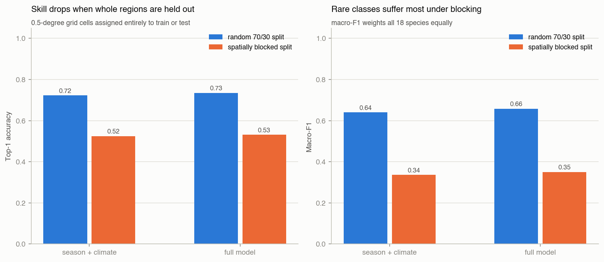

| Model | split | Top-1 | Top-3 | Macro-F1 | MRR |
|---|---|---:|---:|---:|---:|
| M2 season+climate | random | 0.722 | 0.944 | 0.640 | 0.835 |
| M2 season+climate | spatially blocked | 0.524 | 0.853 | 0.336 | 0.701 |
| M4 full | random | 0.734 | 0.947 | 0.657 | 0.843 |
| M4 full | spatially blocked | 0.531 | 0.857 | 0.351 | 0.706 |

**A fifth of the apparent accuracy is location memorisation.** But the
remaining skill is substantial and real: 53.1% Top-1 versus a 35.5% baseline
(+17.6 points) and 85.7% Top-3 versus 60.5% (+25.2 points), in regions the
model has never observed. Macro-F1 suffers most (0.66 → 0.35), meaning the
rare, geographically restricted species are precisely the ones whose
performance was inflated by the random split.

---

## 9. Per-class behaviour

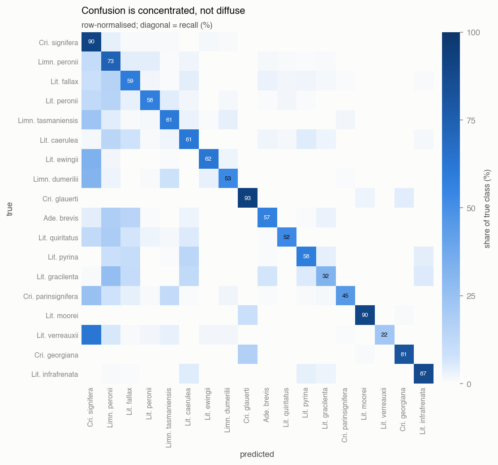

| Species | test n | recall | precision | Top-3 recall |
|---|---:|---:|---:|---:|
| *Crinia glauerti* | 2,144 | 0.930 | 0.905 | 1.000 |
| *Crinia signifera* | 25,830 | 0.904 | 0.797 | 0.990 |
| *Litoria moorei* | 1,067 | 0.899 | 0.939 | 1.000 |
| *Litoria infrafrenata* | 629 | 0.873 | 0.694 | 0.978 |
| *Crinia georgiana* | 641 | 0.814 | 0.833 | 0.995 |
| *Limnodynastes peronii* | 13,011 | 0.734 | 0.687 | 0.972 |
| *Litoria ewingii* | 2,773 | 0.624 | 0.782 | 0.975 |
| *Litoria caerulea* | 3,627 | 0.612 | 0.642 | 0.903 |
| *Litoria fallax* | 5,179 | 0.588 | 0.618 | 0.893 |
| *Adelotus brevis* | 1,646 | 0.566 | 0.608 | 0.892 |
| *Limnodynastes dumerilii* | 2,301 | 0.529 | 0.667 | 0.926 |
| *Crinia parinsignifera* | 1,175 | 0.454 | 0.758 | 0.809 |
| *Litoria gracilenta* | 1,277 | 0.324 | 0.492 | 0.748 |
| *Litoria verreauxii* | 697 | 0.218 | 0.753 | 0.782 |

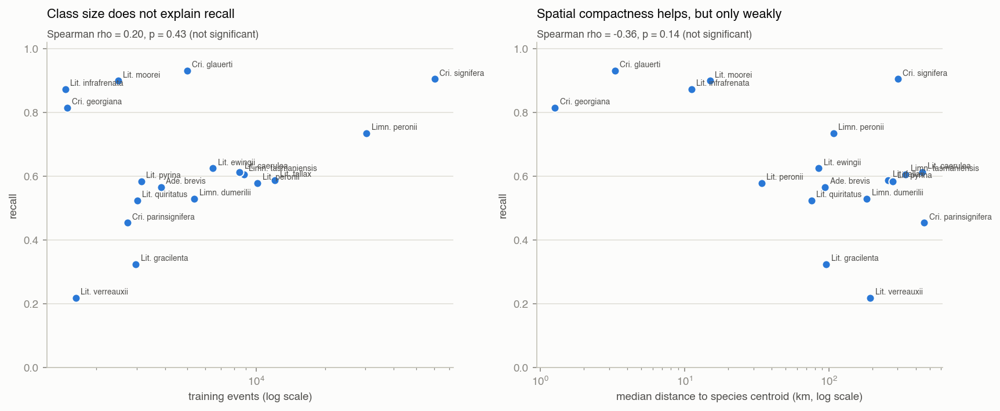

**Recall is not explained by class size** (Spearman ρ = 0.20, p = 0.43 against
log training n) nor significantly by spatial spread (ρ = −0.36, p = 0.14). The
best-recognised species are the *geographically or climatically isolated* ones
— the three WA endemics and the far-north *L. infrafrenata* — irrespective of
whether they have 1,500 or 60,000 training records. The worst are south-eastern
species that share range, climate and season with an abundant congener.

The confusion structure is concentrated rather than diffuse:

| True species | most common error | share of that species |
|---|---|---:|
| *Litoria verreauxii* | → *Crinia signifera* | 62.1% |
| *Litoria ewingii* | → *Crinia signifera* | 32.9% |
| *Limnodynastes dumerilii* | → *Crinia signifera* | 31.4% |
| *Litoria gracilenta* | → *Limnodynastes peronii* | 26.3% |
| *Crinia parinsignifera* | → *Crinia signifera* | 24.9% |

Almost every large error flows into one of the two majority classes. This is
the imbalance, not a lack of environmental separation: Top-3 recall for the
same species is 0.78–0.93, i.e. the true species is usually ranked second or
third. **For a ranking task this is a comparatively benign failure mode**, and
it is an argument for reporting Top-k and MRR alongside Top-1.

---

## 10. Threats to validity

1. **Detections, not abundance.** All distributions are conditional on
   volunteer recording effort. Nothing here estimates occupancy or population
   size.
2. **Effort is seasonally and spatially structured.** November is 19.2% of all
   records; the east coast dominates. Species-by-month patterns partly reflect
   who was recording when.
3. **No true absences.** A species missing from a region may be unrecorded
   rather than absent, which caps how ecological an interpretation the model
   deserves.
4. **Environmental values are climatological normals**, not conditions at the
   time of recording, so within-year weather effects are invisible.
5. **The diagnostic classifier is untuned and evaluated once.** The numbers are
   indicative of information content, not a performance claim; final model
   comparison must be conducted separately, as the EDA plan requires.
6. **Missingness is species-dependent** (§1), so complete-case analyses are
   mildly biased against coastal-edge records.

---

## 11. What this implies for the modelling stage

| # | Decision | Evidence |
|---|---|---|
| 1 | **Validate with spatially blocked CV**, and report random-split numbers only alongside it. | Top-1 falls 0.734 → 0.531 under blocking (§8) |
| 2 | **Never report plain accuracy alone.** Use macro-F1 + Top-1/Top-3 + MRR, always against the prevalence baseline. | M0 already gets 71.7% Top-5 (§2) |
| 3 | **Reduce the climate block** — PCA to ~7 components, or drop one of each \|ρ\| > 0.9 pair — before any linear or distance-based model. | 21 pairs above 0.8; 7 PCs = 95% variance (§5, §6) |
| 4 | **Keep cyclic encodings, drop the raw duplicates.** `month` and `day_of_year` are ρ = 0.994 collinear; `day_of_year_cos` is a top-5 importance term. | §5, §7 |
| 5 | **Decide deliberately whether coordinates are predictors.** They add only +1.1 points over climate but carry most of the memorisation risk. Consider reporting a with- and without-coordinates model. | G0 = 0.695 Top-1 (§7, §8) |
| 6 | **Handle the 4,806 incomplete rows explicitly** — as a stratum, or by imputation with a sensitivity check. Do not drop silently. | Species-dependent missingness (§1) |
| 7 | **Address imbalance directly** (class weights, balanced resampling, or calibrated per-class thresholds) and evaluate per class. | Macro-F1 0.657 vs Top-1 0.734; errors collapse onto 2 classes (§9) |
| 8 | **Prefer non-linear learners**, or add interaction/spline terms if a linear model is required for interpretability. | LDA 0.481 vs RF 0.734 (§7) |
| 9 | **Treat elevation as optional.** | +0.1 points over climate (§7) |
| 10 | **Move the conservation/geoprivacy question to the extension cohort.** | No EPBC-listed species in this dataset (§1) |

---

## 12. Reproducibility

```
eda_species_distribution/
├── eda_species_distribution.R          # full analysis, start to finish
├── EDA_findings_species_distribution.md # this document
└── figures/                            # 16 PNGs referenced above
```

Run from the project root:

```r
source("eda_species_distribution/eda_species_distribution.R")
```

The script reads only `data/processed/frog_primary_multiclass.rds`, writes only
into `eda_species_distribution/figures/`, prints every table quoted here to the
console, and modifies no certified data. Packages: `dplyr`, `tidyr`, `ranger`
(all in `renv.lock`) and `MASS` (ships with R). The random seed is 5003;
the random forests and the two train/test splits are seed-dependent, so
reported accuracies should reproduce to within a few tenths of a point rather
than exactly.

**Provenance note.** R is not installed in the environment where this analysis
was executed, so the figures and the numbers above were produced by an
equivalent Python implementation of the same procedure (pandas / scipy /
scikit-learn, identical splits, seed and model settings). `eda_species_distribution.R`
is the reference implementation for the group's R workflow and should be run
once in the project's `renv` environment to confirm the values before the
results are used in the report.
