# Does the FrogID data carry usable temporal and seasonal information?

**Exploratory data analysis of `data/processed/frog_primary_multiclass.rds`**
STAT5003 group project — FrogID species ranking
Analysis date: 20 September 2026 · Code: [`eda_temporal_seasonal.R`](eda_temporal_seasonal.R)

---

## Verdict

**Yes, but it is the smallest of the three signal blocks, and it is not where
you think it is.** Three findings drive everything below.

**1. Temporal information is real but modest for ranking.** Adding every
temporal variable to a model that already knows location and static climate
lifts Top-1 accuracy by 4.0 points (0.697 → 0.737) and macro-F1 by 0.044
(0.618 → 0.662). Knowing only the calendar month raises a prevalence-only
ranker from 35.4% to 40.3% Top-1.

**2. The information is almost entirely complementary to geography, not
redundant with it.** The month carries 0.335 bits about species on its own;
once the latitude band is already known it still adds 0.324 bits — 97% of its
standalone value survives conditioning on location. Seasonal overlap between
species pairs is statistically unrelated to their spatial overlap
(Spearman ρ = 0.13, p = 0.11). *Crinia glauerti* and *Crinia georgiana* share
99% of their spatial footprint and only 43% of their calendar.

**3. Two of the "climate" predictors are calendar variables in disguise.**
From `climatological_tavg_event_month` and `climatological_prec_event_month`,
a model recovers the exact month of recording **97.8%** of the time (28.9%
without them, 19.3% for always-guessing November). Once these are in the
model, the six explicit calendar predictors add only 0.5 points. Any
"with-season vs without-season" comparison that leaves them in is measuring
nothing.

And one warning that is not about signal at all: **the temporal axis of this
dataset is mostly a record of volunteer behaviour.** November holds 19.2% of
all records because of the annual FrogID Week campaign; weekends are
over-represented; the busiest 1% of days carry 6.9% of the data; and the class
mix drifts year on year. Seasonal patterns must be read after dividing effort
out, and validation must include a forward-in-time split, where accuracy falls
by about 10 points.

---

## 1. Temporal data quality

| Property | Value |
|---|---|
| Rows | 247,406 |
| Date range | 2017-11-10 to 2023-11-09 |
| Calendar days spanned | 2,191 |
| Days with at least one record | 2,191 (no gaps) |
| Missing dates | 0 |
| `month` / `day_of_year` disagreeing with `eventDate` | 0 / 0 |

The cyclic encodings were reverse-engineered and verified exactly:

- `month_sin = sin(2π(month − 1)/12)`, `month_cos` likewise (max error 4×10⁻¹⁶);
- `day_of_year_sin = sin(2π(day_of_year − 1)/L)` where **L is the actual year
  length** (365, or 366 in 2020) — the encoding is leap-year aware.

**2017 and 2023 are partial years** (2017 starts 10 November, 2023 ends
9 November). Any year-on-year comparison that treats them as complete seasons
is wrong: 2017 contains only November and December records, which is exactly
the campaign window.

There is **no time-of-day predictor**. The raw FrogID extract carried
`eventTime` with timezone offsets (see `outputs/tables/event_time_summary.csv`),
but it was not whitelisted into the certified predictor set. Since most target
species call nocturnally, hour-of-night is plausibly informative and is the
most obvious missing temporal feature.

---

## 2. Univariate analysis of time

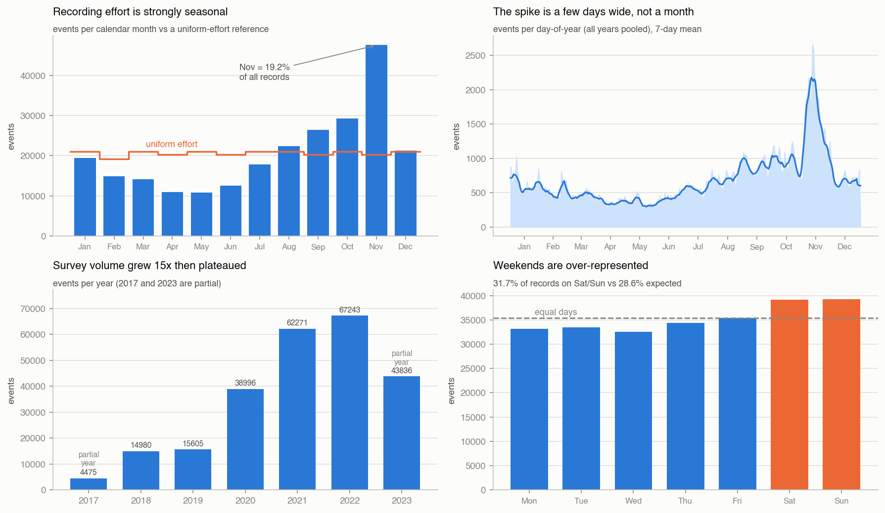

### 2.1 Calendar month

| Month | Jan | Feb | Mar | Apr | May | Jun | Jul | Aug | Sep | Oct | Nov | Dec |
|---|---:|---:|---:|---:|---:|---:|---:|---:|---:|---:|---:|---:|
| events | 19,449 | 14,840 | 14,170 | 10,922 | 10,827 | 12,585 | 17,895 | 22,322 | 26,416 | 29,245 | 47,515 | 21,220 |
| % | 7.9 | 6.0 | 5.7 | 4.4 | 4.4 | 5.1 | 7.2 | 9.0 | 10.7 | 11.8 | **19.2** | 8.6 |

Against a uniform-effort reference adjusted for month length,
χ²(11) = 57,522 (p ≈ 0). November carries 4.4 times the records of April.

### 2.2 Day-of-year, treated as a circular variable

| Statistic | Value |
|---|---|
| Mean resultant length *R* | 0.281 |
| Circular mean date | 28 October |
| Circular standard deviation | 1.59 rad |
| Rayleigh *z* = *nR*² | 19,581 |

*R* = 0.281 means recording is clearly but not overwhelmingly concentrated —
on a 0-to-1 scale where 0 is uniform across the year and 1 is a single day.
(The Rayleigh test rejects uniformity at any imaginable level, but with
n = 247,406 that is uninformative; *R* is the quantity worth reporting.)

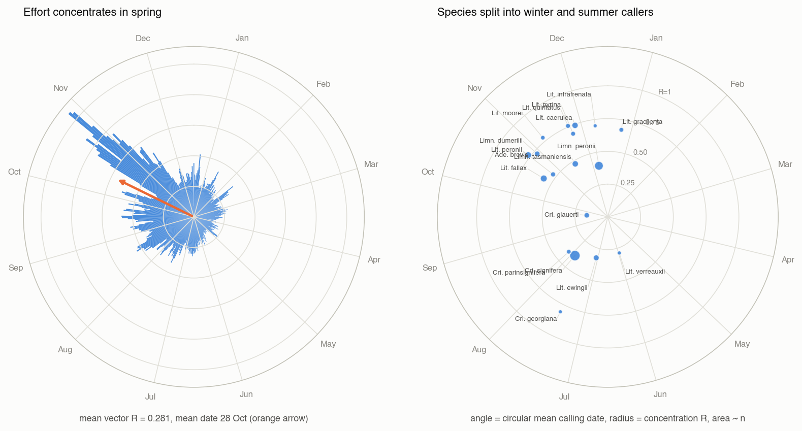

### 2.3 Year, weekday and the daily series

| Year | 2017 | 2018 | 2019 | 2020 | 2021 | 2022 | 2023 |
|---|---:|---:|---:|---:|---:|---:|---:|
| events | 4,475* | 14,980 | 15,605 | 38,996 | 62,271 | 67,243 | 43,836* |

\* partial year.

| Weekday | Mon | Tue | Wed | Thu | Fri | Sat | Sun |
|---|---:|---:|---:|---:|---:|---:|---:|
| % of records | 13.4 | 13.5 | 13.2 | 13.9 | 14.3 | 15.8 | 15.9 |

Weekend share is 31.7% against 28.6% expected — a participation signature, not
a frog signature.

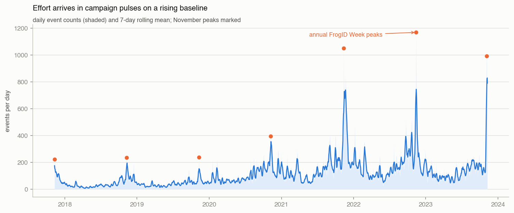

| Daily-series property | Value |
|---|---|
| Median records per day | 84 |
| Busiest day | 1,168 (13 November 2022) |
| Share of all records on the busiest 1% of days | 6.9% |
| Autocorrelation of daily counts, lag 1 | 0.916 |
| Autocorrelation, lag 7 | 0.638 |

The eight busiest days in six years are all in November. Effort arrives in
pulses on a rising baseline.

### 2.4 The November campaign, year by year

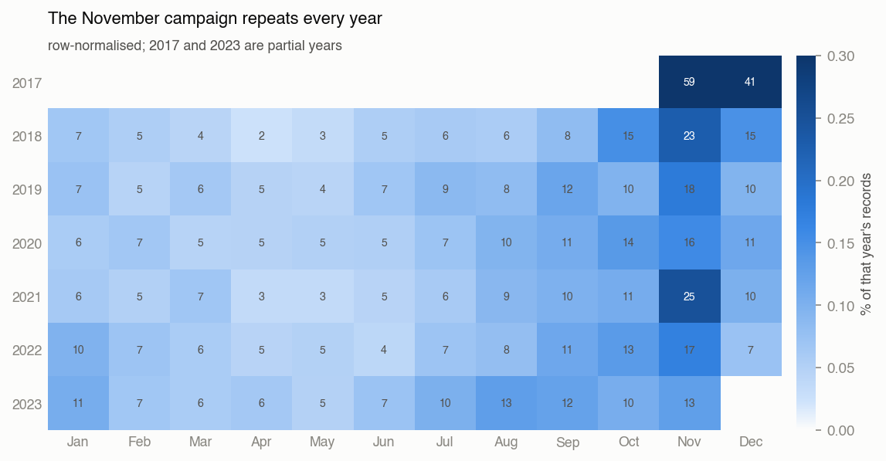

| Year | Oct | Nov | Dec | Nov ÷ mean(Oct, Dec) |
|---|---:|---:|---:|---:|
| 2018 | 2,259 | 3,410 | 2,195 | 1.53 |
| 2019 | 1,511 | 2,791 | 1,484 | 1.86 |
| 2020 | 5,278 | 6,090 | 4,472 | 1.25 |
| 2021 | 6,675 | 15,512 | 6,306 | 2.39 |
| 2022 | 8,939 | 11,496 | 4,918 | 1.66 |

The November step is present in every complete year, and its size varies
between 1.25× and 2.39× the neighbouring months. It is a property of the
survey programme, and it reproduces annually — which means it will appear in
any train and any test split drawn at random.

---

## 3. Bivariate analysis

### 3.1 Does the date shift the species prior?

Conditional entropy of the 18-class label, *H*(species) = 3.214 bits:

| Conditioning variable | *H*(species \| ·) | Mutual information | % of *H* |
|---|---:|---:|---:|
| month | 2.879 | 0.335 bits | 10.4% |
| latitude band | 2.617 | 0.597 bits | 18.6% |
| **month × latitude band** | **2.293** | **0.921 bits** | **28.7%** |
| year | 3.186 | 0.028 bits | 0.9% |
| weekday | 3.212 | 0.003 bits | 0.08% |

The critical line is the third: month alone is worth 0.335 bits, and **0.324
bits of that survive after the latitude band is known**. Season and space are
near-orthogonal sources of information, so a model that already has
coordinates still has almost everything to gain from the calendar.

Weekday is worth nothing (0.08%), as it should be. Its inclusion in any model
would be pure noise.

Translated into ranking performance, knowing only the month:

| Ranker | Top-1 | Top-3 | Top-5 |
|---|---:|---:|---:|
| Global prevalence prior | 0.354 | 0.607 | 0.718 |
| Month-conditional prior | **0.403** | 0.635 | 0.769 |

Because the most likely species actually changes with the month:

| Month | most likely species | its share |
|---|---|---:|
| Jan–Mar, Dec | *Limnodynastes peronii* | 0.24–0.37 |
| Apr–Nov | *Crinia signifera* | 0.23–0.75 |

In June and July, *Crinia signifera* accounts for 75% of all records — the
prior is nearly deterministic in mid-winter and nearly flat in November.

### 3.2 Per-species seasonality

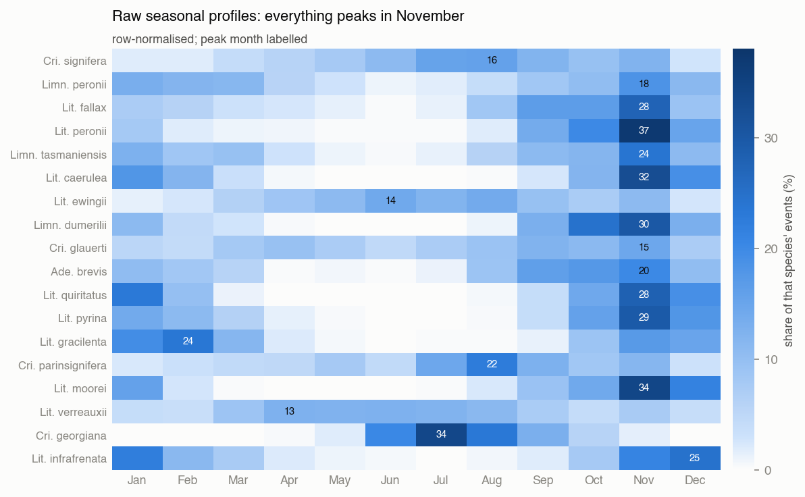

| Species | peak month | peak share | months to 80% | *R* | circular mean date | TVD from effort |
|---|---|---:|---:|---:|---|---:|
| *Crinia georgiana* | Jul | 0.337 | 4 | 0.81 | 30 Jul | 0.582 |
| *Litoria moorei* | Nov | 0.341 | 4 | 0.78 | 23 Nov | 0.379 |
| *Litoria peronii* | Nov | 0.371 | 4 | 0.77 | 10 Nov | 0.357 |
| *Litoria quiritatus* | Nov | 0.281 | 4 | 0.76 | 09 Dec | 0.409 |
| *Litoria caerulea* | Nov | 0.324 | 4 | 0.74 | 13 Dec | 0.397 |
| *Limnodynastes dumerilii* | Nov | 0.299 | 4 | 0.72 | 14 Nov | 0.332 |
| *Litoria infrafrenata* | Dec | 0.245 | 5 | 0.70 | 25 Dec | 0.389 |
| *Litoria gracilenta* | Feb | 0.236 | 5 | 0.67 | 10 Jan | 0.416 |
| *Limnodynastes peronii* | Nov | 0.184 | 7 | 0.40 | 23 Dec | 0.208 |
| *Crinia parinsignifera* | Aug | 0.224 | 7 | 0.40 | 21 Aug | 0.265 |
| *Crinia signifera* | Aug | 0.156 | 7 | 0.39 | 13 Aug | 0.267 |
| *Litoria ewingii* | Jun | 0.141 | 8 | 0.32 | 19 Jul | 0.300 |
| *Litoria verreauxii* | Apr | 0.126 | 8 | 0.29 | 15 Jun | 0.338 |
| *Crinia glauerti* | Nov | 0.146 | 9 | 0.16 | 07 Oct | 0.116 |

(TVD = total variation distance between the species' own monthly distribution
and the overall effort calendar: 0 means the species is recorded exactly when
people record, 1 means completely different months.)

### 3.3 Effort-adjusted seasonality — where the real phenology is

The raw heatmap above says "everything peaks in November", which is mostly a
statement about volunteers. Dividing each species' monthly share by the
overall monthly effort share removes the campaign and leaves the biology.

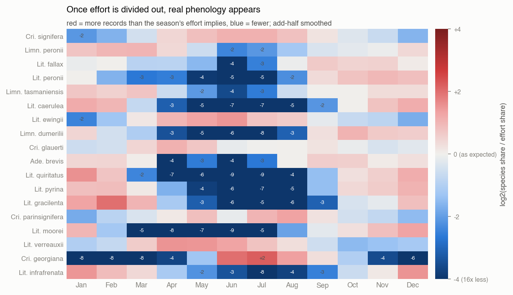

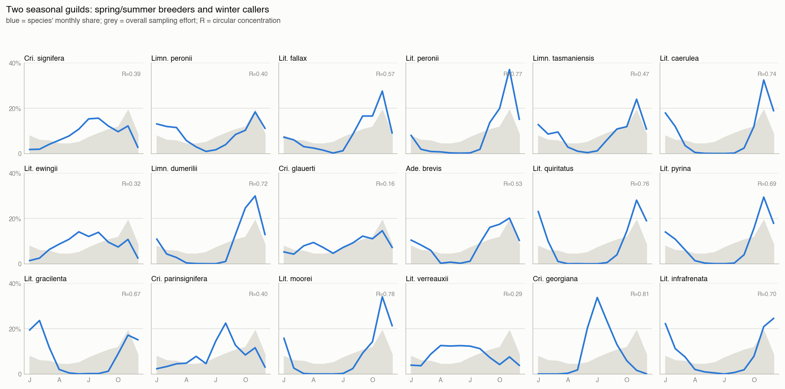

Two seasonal guilds appear clearly once effort is divided out:

- **Winter/early-spring callers** — *Crinia georgiana* (July, 4.7× its
  effort-implied share), *Litoria ewingii* (June, 2.8×), *Crinia signifera*
  and *C. parinsignifera* (June–August, 2.1–2.5×), *Litoria verreauxii*
  (April–June, ~2.8×). These species peak when almost nobody is recording,
  which is the strongest possible evidence that the pattern is not an effort
  artefact.
- **Spring/summer breeders** — *Litoria caerulea*, *L. quiritatus*,
  *L. pyrina*, *Limnodynastes dumerilii*, *L. moorei*: near-absent in
  mid-winter (30× to 660× below their effort-implied share in July) and
  over-represented in December–February.

*Crinia glauerti* is the exception that proves the rule: its profile tracks
the effort curve almost exactly (TVD 0.116, *R* 0.16), so it contributes
essentially no seasonal discrimination.

### 3.4 Season versus space

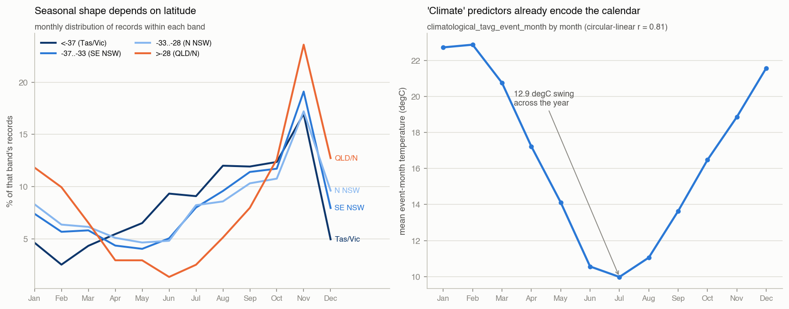

| Latitude band | n | *R* | circular mean date |
|---|---:|---:|---|
| < −37 (Tas/Vic) | 44,040 | 0.296 | 14 Sep |
| −37 to −33 (SE NSW) | 114,173 | 0.287 | 22 Oct |
| −33 to −28 (N NSW) | 44,484 | 0.243 | 01 Nov |
| > −28 (QLD/N) | 44,709 | 0.458 | 03 Dec |

The tropics show the most concentrated and the latest season (a wet-season
pattern); the south is earlier and flatter. **Season interacts with latitude**,
which is why the joint month × latitude-band information (0.921 bits) exceeds
the sum of neither-conditioned parts.

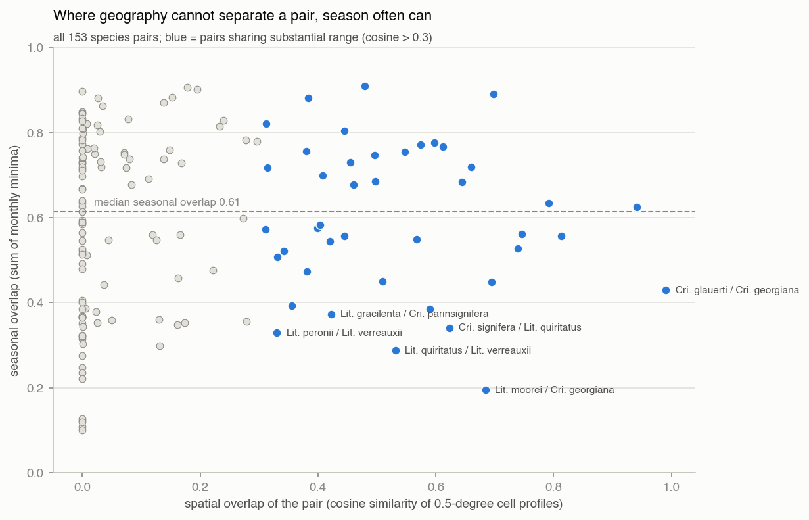

Across all 153 species pairs, seasonal overlap has a median of 0.61 (mean
0.59, range 0.10–0.91) and is **unrelated to spatial overlap** (Spearman ρ = 0.13,
p = 0.11; mean overlap 0.600 for the 42 pairs sharing substantial range versus
0.586 for the rest). The pairs that matter are the ones in the lower right —
same place, different calendar:

| Pair | spatial overlap | seasonal overlap |
|---|---:|---:|
| *Litoria moorei* / *Crinia georgiana* | 0.684 | 0.195 |
| *Litoria quiritatus* / *Litoria verreauxii* | 0.531 | 0.287 |
| *Crinia signifera* / *Litoria quiritatus* | 0.623 | 0.340 |
| *Litoria gracilenta* / *Crinia parinsignifera* | 0.422 | 0.373 |
| *Litoria ewingii* / *Limnodynastes dumerilii* | 0.589 | 0.386 |
| *Crinia glauerti* / *Crinia georgiana* | **0.991** | 0.430 |

This is the core argument for keeping temporal predictors: for the pairs where
coordinates are almost useless, the calendar is not.

### 3.5 Season versus climate — the leak

Circular-linear correlation of day-of-year with each continuous predictor:

| Predictor | *r*<sub>cl</sub> |
|---|---:|
| `climatological_tavg_event_month` | **0.809** |
| `climatological_prec_event_month` | 0.403 |
| decimalLatitude | 0.230 |
| BIO1 (annual mean temperature) | 0.227 |
| elevation | 0.075 |

The event-month climatology swings from 10.0 °C (July) to 22.9 °C (February)
— it is a thermometer for the calendar. A linear reconstruction confirms it:

| Target | *R*² from month alone | from location + static climate | from both |
|---|---:|---:|---:|
| `climatological_tavg_event_month` | 0.670 | 0.539 | **0.981** |
| `climatological_prec_event_month` | 0.201 | 0.455 | 0.572 |

The static BIO1–BIO19 normals, by contrast, are annual constants for a
location and carry no calendar content of their own (BIO1's *r*<sub>cl</sub> of
0.227 reflects *where* people record in each season, not *when*).

### 3.6 Is the class mix stable over time?

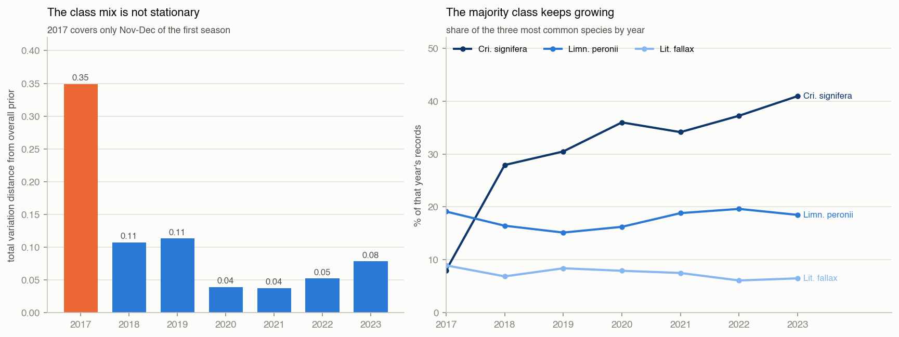

Total variation distance between each year's species composition and the
overall prior:

| Year | 2017 | 2018 | 2019 | 2020 | 2021 | 2022 | 2023 |
|---|---:|---:|---:|---:|---:|---:|---:|
| TVD | 0.349 | 0.107 | 0.113 | 0.039 | 0.038 | 0.052 | 0.079 |

*Crinia signifera* grows from 27.9% of records in 2018 to 40.9% in 2023;
*Litoria peronii* falls from 9.5% to 5.2%. The mix is only approximately
stationary from 2020 onward, and 2017 is a different dataset altogether
(Nov–Dec only, early adopters). The label distribution a model learns
therefore depends on which years it is trained on.

---

## 4. How much does temporal information actually add?

A random forest probe (150 trees, `min.node.size = 5`, 70/30 stratified split
of the 242,600 complete cases) with one block of predictors added at a time.

**A methodological note that changes the answer.** With the default
`mtry = √p`, an 8-predictor model scored *below* a 2-predictor model
(0.649 vs 0.695 Top-1) purely because the two informative coordinates were
offered to each split less often. Every model below therefore uses
`mtry = p` (all predictors considered at each split), which is the only fair
way to compare blocks of different size. This diagnostic is a measure of
information content, not a model-selection exercise.

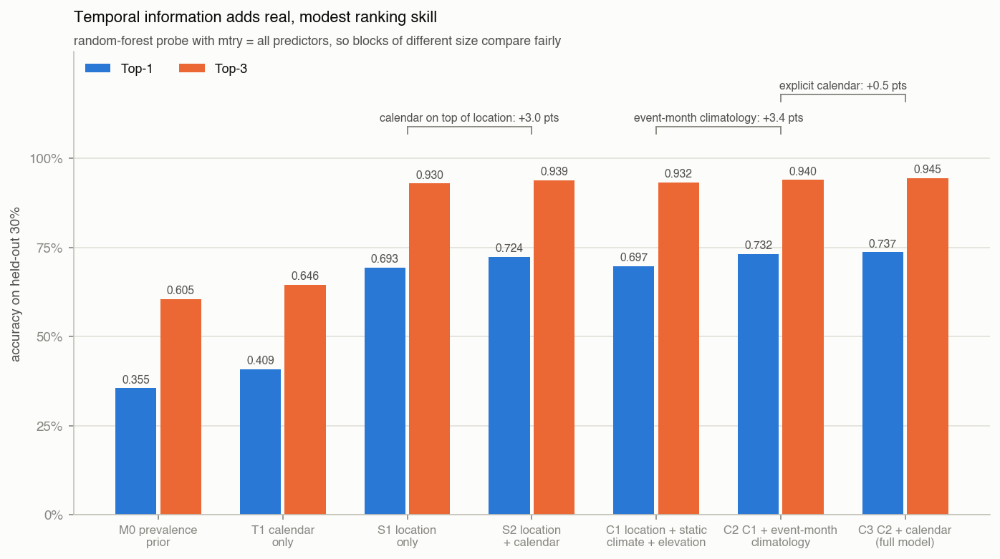

| Model | predictors | Top-1 | Top-3 | Macro-F1 | MRR |
|---|---:|---:|---:|---:|---:|
| M0 prevalence prior | 0 | 0.355 | 0.605 | 0.029 | 0.525 |
| T1 calendar only | 6 | 0.409 | 0.646 | 0.067 | 0.568 |
| S1 location only | 2 | 0.693 | 0.930 | 0.611 | 0.814 |
| S2 location + calendar | 8 | 0.724 | 0.939 | 0.643 | 0.834 |
| C1 location + static climate + elevation | 22 | 0.697 | 0.932 | 0.618 | 0.817 |
| C2 C1 + event-month climatology | 24 | 0.732 | 0.940 | 0.654 | 0.839 |
| C3 C2 + calendar (full model) | 30 | **0.737** | **0.945** | **0.662** | **0.843** |

Marginal values in Top-1 accuracy:

| Step | Δ Top-1 | Reading |
|---|---:|---|
| Calendar on top of location alone (S1 → S2) | **+3.0 pts** | season's honest contribution |
| Event-month climatology on top of static climate (C1 → C2) | **+3.4 pts** | this *is* seasonal information |
| Explicit calendar on top of that (C2 → C3) | **+0.5 pts** | mostly already there |
| All temporal information (C1 → C3) | **+4.0 pts** | macro-F1 +0.044 |
| Calendar alone, against prevalence (M0 → T1) | +5.4 pts | weak in isolation |

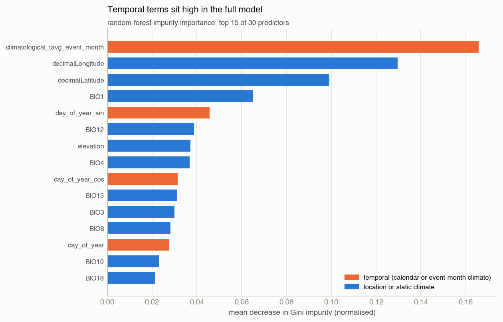

Impurity importance in the full model puts `climatological_tavg_event_month`
**first of all 30 predictors**. Among the six calendar variables, the ranking
is stark:

| Predictor | importance rank (of 30) |
|---|---:|
| `climatological_tavg_event_month` | 1 |
| `day_of_year_sin` | 5 |
| `day_of_year_cos` | 9 |
| `day_of_year` | 13 |
| `climatological_prec_event_month` | 16 |
| `month_sin` | 28 |
| `month` | 29 |
| `month_cos` | 30 |

**The day-of-year encodings do all the work; the month encodings are dead
weight.** They are a 12-level coarsening of information the model already has
at daily resolution.

### 4.1 The calendar is recoverable from the "climate" predictors

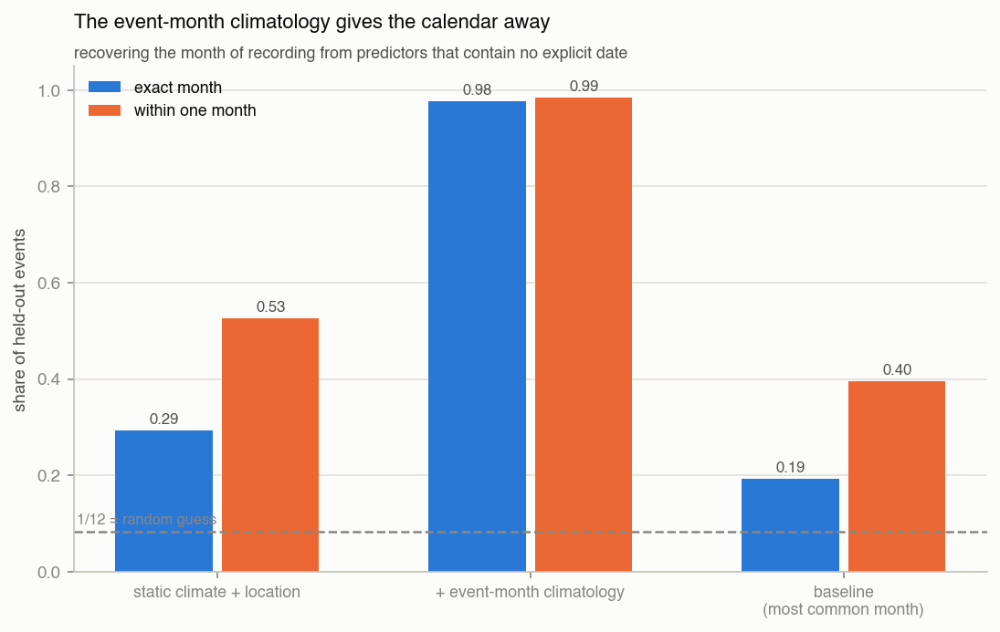

Predicting the calendar month of a held-out event from predictors containing
no explicit date:

| Features | exact month | within one month | mean circular error (months) |
|---|---:|---:|---:|
| Baseline (always November) | 0.193 | 0.396 | 2.29 |
| Location + static climate + elevation | 0.294 | 0.527 | 1.82 |
| **+ event-month climatology** | **0.978** | **0.985** | **0.06** |

Two things follow. First, the two event-month variables are a near-perfect
month encoding, so they must be treated as temporal predictors in any
ablation. Second — and more subtly — location and static climate alone already
recover the month 29.4% of the time, well above the 19.3% baseline: *where* a
record comes from partly tells you *when* it was made, because different
regions are surveyed in different seasons.

### 4.2 Which species does season actually help?

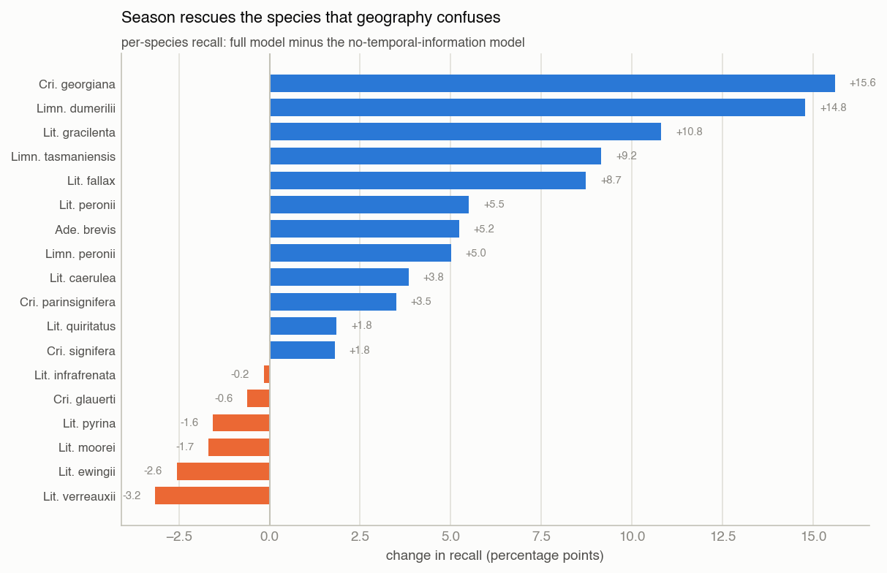

Change in per-species recall from adding all temporal information (C1 → C3):

| Species | recall without time | with time | change |
|---|---:|---:|---:|
| *Crinia georgiana* | 0.672 | 0.828 | **+15.6 pts** |
| *Limnodynastes dumerilii* | 0.386 | 0.534 | **+14.8 pts** |
| *Litoria gracilenta* | 0.244 | 0.352 | +10.8 pts |
| *Limnodynastes tasmaniensis* | 0.518 | 0.610 | +9.2 pts |
| *Litoria fallax* | 0.513 | 0.601 | +8.7 pts |
| *Litoria peronii* | 0.540 | 0.595 | +5.5 pts |
| *Crinia signifera* | 0.881 | 0.899 | +1.8 pts |
| *Crinia glauerti* | 0.937 | 0.931 | −0.6 pts |
| *Litoria moorei* | 0.913 | 0.896 | −1.7 pts |
| *Litoria ewingii* | 0.662 | 0.636 | −2.6 pts |
| *Litoria verreauxii* | 0.263 | 0.231 | −3.2 pts |

The average +4.0 points conceals a much more useful pattern. The species that
gain are exactly the ones §3.4 identified: *C. georgiana*, which is spatially
inseparable from *C. glauerti* but calls in a different season, and
*Limnodynastes dumerilii*, which shares range with *L. ewingii*. The species
that lose are the spatially isolated ones already recognised at >90% recall,
where extra predictors only add variance.

*Litoria verreauxii* is worth a note: its recall falls 3.2 points but its
**Top-3 recall rises 11.8 points** (0.650 → 0.768). For a ranking task that is
a gain, not a loss — another reason not to judge this project on Top-1 alone.

### 4.3 Forward-in-time validation

Train on 2017–2021 (133,546 events), test on 2022–2023 (109,054 events).

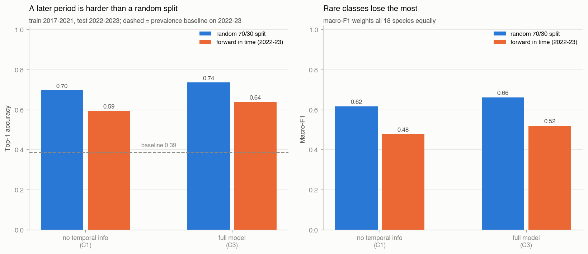

| Model | split | Top-1 | Top-3 | Macro-F1 |
|---|---|---:|---:|---:|
| M0 prevalence prior | forward in time | 0.389 | 0.640 | 0.031 |
| C1 no temporal info | random 70/30 | 0.697 | 0.932 | 0.618 |
| C1 no temporal info | forward in time | 0.595 | 0.883 | 0.479 |
| C3 full model | random 70/30 | 0.737 | 0.945 | 0.662 |
| C3 full model | **forward in time** | **0.640** | 0.909 | 0.522 |

Predicting a later period costs about 10 accuracy points and 0.14 macro-F1 —
a penalty of the same order as the spatial-blocking penalty found in the
species-distribution EDA. Notably, **the temporal block's contribution
survives the harder split**: +4.5 points forward-in-time versus +4.0 points on
a random split. Season is not what the model is over-fitting; location is.

---

## 5. Threats to validity

1. **Effort, not abundance.** The temporal distribution of records is
   primarily a distribution of volunteer activity. Only the effort-adjusted
   view (§3.3) supports phenological interpretation.
2. **The campaign is inside every split.** FrogID Week recurs each November,
   so a random split cannot detect dependence on it. A model that has learned
   "November ⇒ campaign-style records" will look fine in cross-validation.
3. **Two partial years.** 2017 (Nov–Dec only) and 2023 (to 9 November) distort
   any annual comparison and inflate the apparent November share slightly.
4. **Non-stationary class mix.** The species composition drifts (TVD 0.35 in
   2017, ~0.04 from 2020), so the prior a model learns is period-specific.
5. **No time of day**, although the raw source has it — likely the single
   biggest missing temporal feature for nocturnally calling frogs.
6. **Climatological normals, not weather.** The event-month climate variables
   describe a typical month at that location, not the conditions on the night
   of recording, so they cannot capture weather-triggered calling.
7. **The diagnostic classifier is untuned and evaluated once.** Differences
   below roughly half a point should not be over-read.

---

## 6. What this implies for the modelling stage

| # | Decision | Evidence |
|---|---|---|
| 1 | **Keep temporal predictors, but budget ~4 points, not a transformation.** The value is concentrated in specific confusable species, not spread evenly. | C1 → C3 +4.0 pts; per-class +15.6 to −3.2 (§4, §4.2) |
| 2 | **Treat `climatological_*_event_month` as temporal, not climatic.** Any season ablation that leaves them in measures nothing. | month recovered at 97.8% from them (§4.1) |
| 3 | **Drop `month`, `month_sin`, `month_cos`; keep `day_of_year_sin/cos`.** The month encodings rank 28th, 29th and 30th of 30. | importance ranking (§4) |
| 4 | **Add a forward-in-time split to the validation design**, alongside the spatially blocked one. Report both. | Top-1 0.737 → 0.640 (§4.3) |
| 5 | **Consider excluding 2017**, or at least reporting sensitivity to it, and never treat 2017/2023 as full years. | TVD 0.349; Nov–Dec only (§1, §3.6) |
| 6 | **Never use `weekday`, and do not use `year` as a predictor.** | MI 0.08% and 0.9% (§3.1) |
| 7 | **Interpret seasonal effects only after effort adjustment**, and say so explicitly in the report. | raw vs adjusted heatmaps (§3.2–3.3) |
| 8 | **Model season × region, not season alone**, if an interpretable model is used — the seasonal shape differs by latitude band. | joint MI 0.921 vs 0.597 + 0.335 (§3.1, §3.4) |
| 9 | **Report Top-3 and MRR.** Temporal information improves the ranking of species whose Top-1 it does not fix. | *L. verreauxii* Top-3 +11.8 pts (§4.2) |
| 10 | **If the source data can be revisited, recover time-of-day.** | no temporal predictor below daily resolution (§1) |

---

## 7. Reproducibility

```
eda_temporal_seasonal/
├── eda_temporal_seasonal.R             # full analysis, start to finish
├── EDA_findings_temporal_seasonal.md   # this document
└── figures/                            # 15 PNGs referenced above
```

Run from the project root:

```r
source("eda_temporal_seasonal/eda_temporal_seasonal.R")
```

The script reads only `data/processed/frog_primary_multiclass.rds`, writes only
into `eda_temporal_seasonal/figures/`, prints every table quoted here to the
console, and modifies no certified data. Packages: `dplyr`, `tidyr`, `ranger`
(all in `renv.lock`). The seed is 5003; forests and splits are seed-dependent,
so accuracies should reproduce to within a few tenths of a point.

**Provenance note.** R is not installed in the environment where this analysis
was executed, so the figures and numbers above were produced by an equivalent
Python implementation of the same procedure (pandas / scipy / scikit-learn,
identical splits, seed and model settings, `max_features=None` corresponding to
`mtry = p`). `eda_temporal_seasonal.R` is the reference implementation for the
group's R workflow and should be run once in the project's `renv` environment
to confirm the values before the results are used in the report.

**Relationship to the species-distribution EDA.** That analysis
([`../eda_species_distribution/`](../eda_species_distribution/)) asked whether
the data identifies species at all and found geography dominant. This one
isolates the temporal axis and shows where it adds something geography cannot.
The two share the dataset, the seed and the 70/30 split, but the ladders differ:
this document uses `mtry = p` for fairness across block sizes, so its Top-1
figures differ from the earlier ones by a few tenths of a point.
